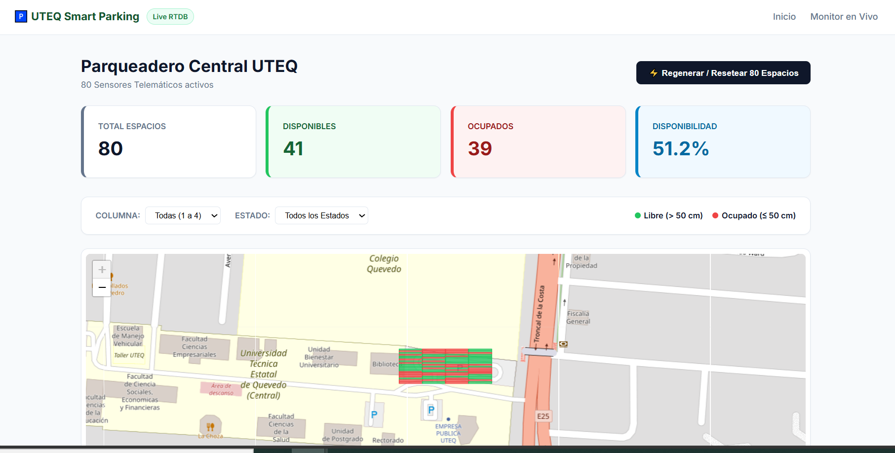

# 🅿️ Estacionamiento Inteligente con React y Firebase RTDB

Sistema web inteligente de gestión de estacionamientos desarrollado con **React**, **Vite** y **Firebase Realtime Database**. Permite visualizar, filtrar y monitorear espacios de estacionamiento en tiempo real.

## ✨ Características Principales

- **Visualización en Tiempo Real**: Monitoreo de espacios de estacionamiento usando Firebase RTDB
- **Mapa Interactivo**: Integración con Leaflet para visualización geográfica de espacios
- **Filtros Dinámicos**: Filtrar espacios por estado (disponible, ocupado, reservado)
- **Historial de Espacios**: Registro de cambios y movimientos en los espacios
- **Resumen Estadístico**: Dashboard con estadísticas generales del estacionamiento
- **Cuadrícula Visual**: Vista en cuadrícula de todos los espacios disponibles
- **Detalles por Espacio**: Información detallada de cada espacio con historial
- **Interfaz Responsiva**: Diseño adaptable a diferentes dispositivos

## 🛠️ Tecnologías Utilizadas

### Frontend
- **React 19.2** - Librería UI moderna
- **Vite 8.2** - Build tool rápido y eficiente
- **React Router 7.18** - Enrutamiento de páginas
- **React Leaflet 5.0** - Integración de mapas interactivos
- **Leaflet 1.9** - Librería de mapas

### Backend & Datos
- **Firebase 12.17** - Backend como servicio
- **Firebase Realtime Database** - Base de datos en tiempo real

### UI & Iconografía
- **Lucide React 1.31** - Librería de iconos
- **Oxlint** - Linter de código

## 📁 Estructura del Proyecto

```
parqueadero-uteq/
├── src/
│   ├── components/
│   │   ├── CuadriculaEstacionamiento.jsx    # Visualización en cuadrícula
│   │   ├── EspacioCard.jsx                   # Tarjeta individual de espacio
│   │   ├── FiltrosEspacios.jsx               # Panel de filtros
│   │   ├── HistorialEspacio.jsx              # Registro de cambios
│   │   ├── MapaEstacionamiento.jsx           # Mapa interactivo
│   │   ├── Navbar.jsx                        # Barra de navegación
│   │   └── ResumenEstacionamiento.jsx        # Dashboard estadístico
│   ├── hooks/
│   │   ├── useEspacios.jsx                   # Hook para gestionar espacios
│   │   └── useHistorialEspacio.jsx           # Hook para historial
│   ├── pages/
│   │   ├── Inicio.jsx                        # Página principal
│   │   ├── Estacionamiento.jsx               # Página de visualización
│   │   └── DetalleEspacio.jsx                # Página de detalles
│   ├── services/
│   │   ├── firebase.js                       # Configuración Firebase
│   │   ├── geometria.js                      # Cálculos geométricos
│   │   └── simulator.js                      # Simulador de datos
│   ├── App.jsx                               # Componente principal
│   ├── main.jsx                              # Punto de entrada
│   └── index.css                             # Estilos globales
├── public/
│   ├── 1.png                                 # Imagen de galería
│   ├── 2.png                                 # Imagen de galería
│   ├── 3.png                                 # Imagen de galería
│   ├── 4.png                                 # Imagen de galería
│   ├── favicon.svg
│   └── icons.svg
├── vite.config.js                            # Configuración de Vite
├── package.json
└── README.md
```

## 📸 Galería del Proyecto

### Screenshot 1


### Screenshot 2


## 🚀 Instalación y Configuración

### Requisitos Previos
- Node.js 16+ 
- npm o yarn
- Cuenta de Firebase

### 1. Clonar el Repositorio
```bash
git clone <url-del-repositorio>
cd parqueadero-uteq
```

### 2. Instalar Dependencias
```bash
npm install
```

### 3. Configurar Variables de Entorno

Crear un archivo `.env.local` en la raíz del proyecto con las credenciales de Firebase:

```env
VITE_FIREBASE_API_KEY=tu_api_key
VITE_FIREBASE_AUTH_DOMAIN=tu_auth_domain
VITE_FIREBASE_DATABASE_URL=tu_database_url
VITE_FIREBASE_PROJECT_ID=tu_project_id
VITE_FIREBASE_STORAGE_BUCKET=tu_storage_bucket
VITE_FIREBASE_MESSAGING_SENDER_ID=tu_messaging_sender_id
VITE_FIREBASE_APP_ID=tu_app_id
```

### 4. Ejecutar en Desarrollo
```bash
npm run dev
```

La aplicación estará disponible en `http://localhost:5173`

## 📜 Scripts Disponibles

```bash
# Desarrollo con HMR
npm run dev

# Build para producción
npm run build

# Verificar linting
npm run lint

# Preview de build
npm run preview
```

## 🏗️ Arquitectura de Componentes

### Componentes Principales
- **Navbar**: Navegación principal de la aplicación
- **CuadriculaEstacionamiento**: Muestra todos los espacios en formato cuadrícula
- **MapaEstacionamiento**: Visualización geográfica interactiva
- **EspacioCard**: Tarjeta individual con información del espacio
- **FiltrosEspacios**: Panel de filtrado por estado y ubicación
- **ResumenEstacionamiento**: Dashboard con estadísticas generales
- **HistorialEspacio**: Registro de cambios y movimientos

### Hooks Personalizados
- **useEspacios**: Gestiona la lógica de espacios y sincronización con Firebase
- **useHistorialEspacio**: Maneja el historial de cambios de un espacio

### Servicios
- **firebase.js**: Configuración e inicialización de Firebase
- **geometria.js**: Utilidades para cálculos geométricos
- **simulator.js**: Simulador para generar datos de prueba

## 🔄 Flujo de Datos

1. **Firebase RTDB** → Proporciona datos en tiempo real
2. **Hooks** → Consumen y procesan los datos
3. **Componentes** → Renderizan la interfaz con los datos
4. **User Interaction** → Actualiza datos en Firebase

## 📱 Rutas de la Aplicación

- `/` - Página de inicio
- `/estacionamiento` - Vista principal de estacionamiento
- `/espacios/:id` - Detalles de un espacio específico

## 🎯 Funcionalidades por Página

### Inicio (/)
- Bienvenida al sistema
- Links de navegación principal
- Información general

### Estacionamiento (/estacionamiento)
- Vista en cuadrícula de espacios
- Vista en mapa interactivo
- Panel de filtros
- Resumen de estadísticas
- Historial de cambios

### Detalles (/espacios/:id)
- Información completa del espacio
- Historial de movimientos
- Estado actual y cambios históricos

## 📊 Estructura de Datos Firebase

```
espacios/
├── [space_id]/
│   ├── numero: number
│   ├── estado: "disponible" | "ocupado" | "reservado"
│   ├── ubicacion: string
│   ├── piso: number
│   ├── coordenadas: { lat: number, lng: number }
│   └── historial: [...]
```

## 🔧 Configuración de Vite

El proyecto usa Vite con React plugin para un desarrollo rápido con HMR (Hot Module Replacement). También incluye Oxlint para linting de código.

## 📝 Licencia

Este proyecto es parte del desarrollo académico de la UTEQ.

## 👥 Autor

Desarrollado por: Suárez

---

**¿Necesitas ayuda?** Revisa la documentación oficial:
- [React Docs](https://react.dev)
- [Vite Docs](https://vitejs.dev)
- [Firebase Docs](https://firebase.google.com/docs)
- [React Router](https://reactrouter.com)
- [Leaflet Docs](https://leafletjs.com)
